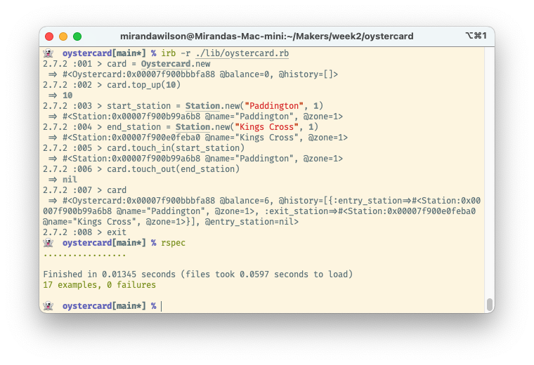

## Oystercard

The London Underground transport network uses a prepaid card system for access and payment. The cards are called Oystercards (as in the phrase "the world is your oyster"). As part of the [Makers Academy](https://makers.tech) coding bootcamp, we were challenged to create a command line Oystercard system as a way to learn TDD and practise pair programming. This was in week 2 of the 12 week course, so it's pretty simple.  

### Description

We were given these user stories:
```
In order to use public transport
As a customer
I want money on my card

In order to keep using public transport
As a customer
I want to add money to my card

In order to protect my money
As a customer
I don't want to put too much money on my card

In order to pay for my journey
As a customer
I need my fare deducted from my card

In order to get through the barriers
As a customer
I need to touch in and out

In order to pay for my journey
As a customer
I need to have the minimum amount for a single journey

In order to pay for my journey
As a customer
I need to pay for my journey when it's complete

In order to pay for my journey
As a customer
I need to know where I've travelled from

In order to know where I have been
As a customer
I want to see to all my previous trips

In order to know how far I have travelled
As a customer
I want to know what zone a station is in

In order to be charged correctly
As a customer
I need a penalty charge deducted if I fail to touch in or out

In order to be charged the correct amount
As a customer
I need to have the correct fare calculated
```

The majority of this repo was written using alternating pair programming. The other contributors were [RTurney](https://github.com/RTurney) and [MegGosnell](https://github.com/MegGosnell).  

### Installation and Usage

To try out the project:
* Make sure Ruby 2.7.2 and Bundler installed
* Clone this repo
* Navigate into the cloned folder
* Run `bundle` to install rspec
* Run `irb -r ./lib/oystercard`
* Play with the code in the IRB REPL
* To run the tests, exit from irb
* Run `rspec`
  
Here's a screenshot of the code in action:  


